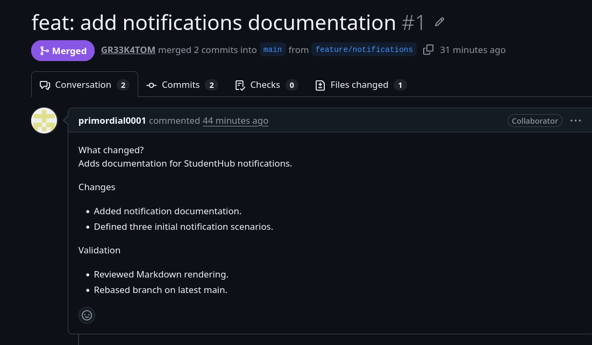
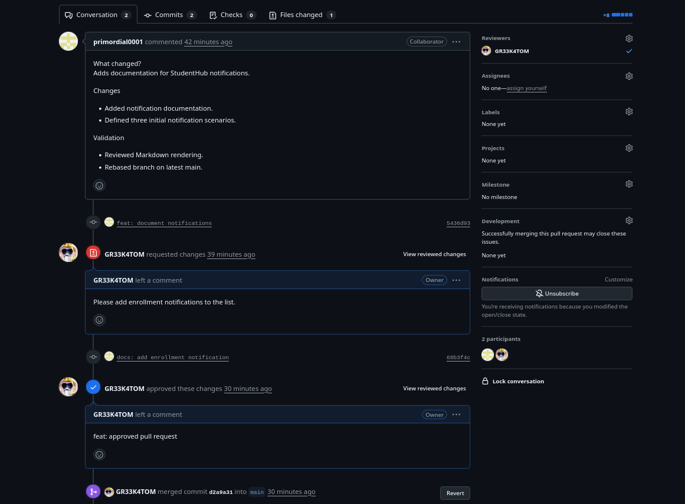

# Evidencias de lab-git-github

```bash
# Integrantes:
# Developer A (Gabriel Pineda)
# Developer B (Kaleth Hernandez)
# Laboratorio martes, 25 de agosto de 2026
# Grupo 2 - Programacion para web
# Tematica: git y github
```

# URL del repositorio
### https://github.com/GR33K4TOM/studenthub-git-lab
# URL de un pull request
### https://github.com/GR33K4TOM/studenthub-git-lab/pull/1

# Historial del repositorio

### https://github.com/GR33K4TOM/studenthub-git-lab/activity

# Evidencia de pull request

<picture>

</picture>

# Evidencia de resolucion de conflictos
<picture>

</picture>

Salida del comando 
```bash
$ git log --oneline --graph --decorate --all
* 17f79e8 (origin/feature/contributing-guide) docs: add team-rules.md
| * 5907eb5 (origin/feature/team-rules, feature/team-rules) docs: make and upload add-team-rules.md
|/
*   d2a9a31 (HEAD -> main, origin/main, origin/HEAD) Merge pull request #1 from GR33K4TOM/feature/notifications
|\
| * 68b3f4c (origin/feature/notifications) docs: add enrollment notification
| * 5436d93 feat: document notifications
* | 20d6010 docs: describe collaboration workflow
|/
| *   ad0f695 (origin/feature/update-description-b) Merge branch 'main' into feature/update-description-b
| |\
| |/
|/|
* | 70c07eb (origin/feature/update-description-a, feature/update-description-a) docs: improve project description
| * 09be6f2 docs: rewrite StudentHub description
|/
| * 6140d03 (origin/feature/student-profile, feature/student-profile) feat: document student profile
|/
* b2068e1 (origin/feature/course-catalog) docs: document repository management
* 22603be Update developer names in README
* a09cab1 docs: add project information
* c38b1b1 docs: add initial StudentHub README
```
Salida del comando
```bash
$ git branch -a

  feature/student-profile
  feature/team-rules
  feature/update-description-a
* main
  remotes/origin/HEAD -> origin/main
  remotes/origin/feature/contributing-guide
  remotes/origin/feature/course-catalog
  remotes/origin/feature/notifications
  remotes/origin/feature/student-profile
  remotes/origin/feature/team-rules
  remotes/origin/feature/update-description-a
  remotes/origin/feature/update-description-b
  remotes/origin/main
```
Salida del comando
```bash
$ git remote -v
origin	https://github.com/GR33K4TOM/studenthub-git-lab (fetch)
origin	https://github.com/GR33K4TOM/studenthub-git-lab (push)
```

